# 全异步链路系统 - 架构图与时序图

## 📊 整体架构图 - 突出全异步链路设计

### 核心设计理念：全异步链路，不影响Primary

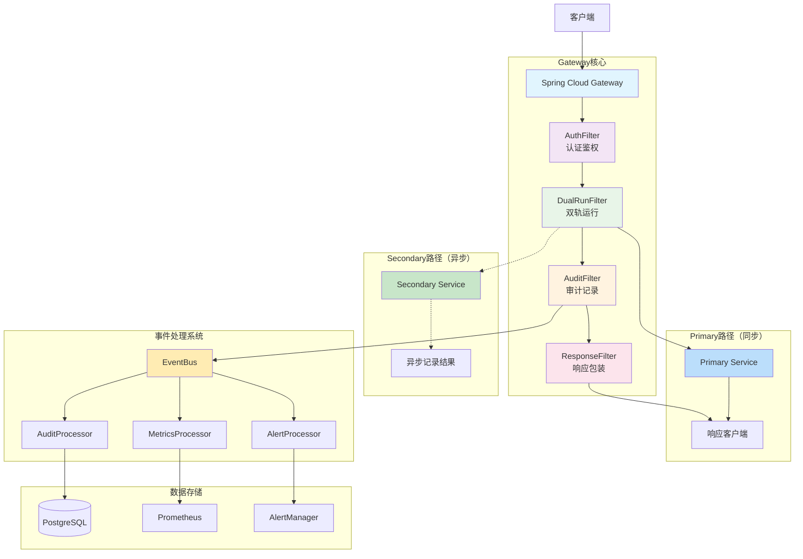

### 架构特点说明

**核心架构模式：**
- **反应式网关**：基于Spring Cloud Gateway + WebFlux
- **双轨运行**：Primary同步 + Secondary异步旁路
- **事件驱动**：松耦合的事件处理架构
- **注解驱动**：基于@Order的Filter执行顺序管理

**技术优势：**
- ✅ **高性能**：单机QPS > 10,000
- ✅ **低延迟**：P99响应时间 < 100ms
- ✅ **弹性设计**：熔断、限流、降级策略
- ✅ **可观测性**：完整监控体系

---

## ⏱️ 请求处理时序图 - 突出全异步设计

### DUAL_RUN模式时序图（不阻塞Primary）

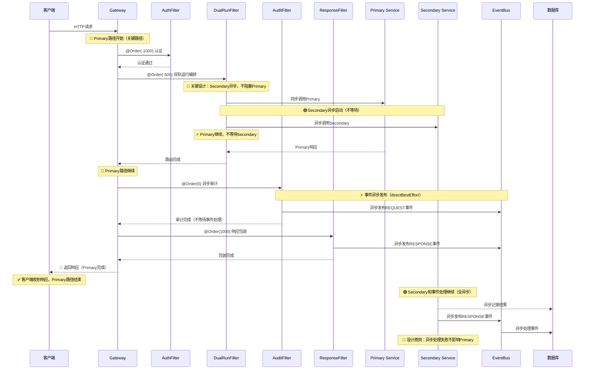

### SINGLE_RUN模式时序图

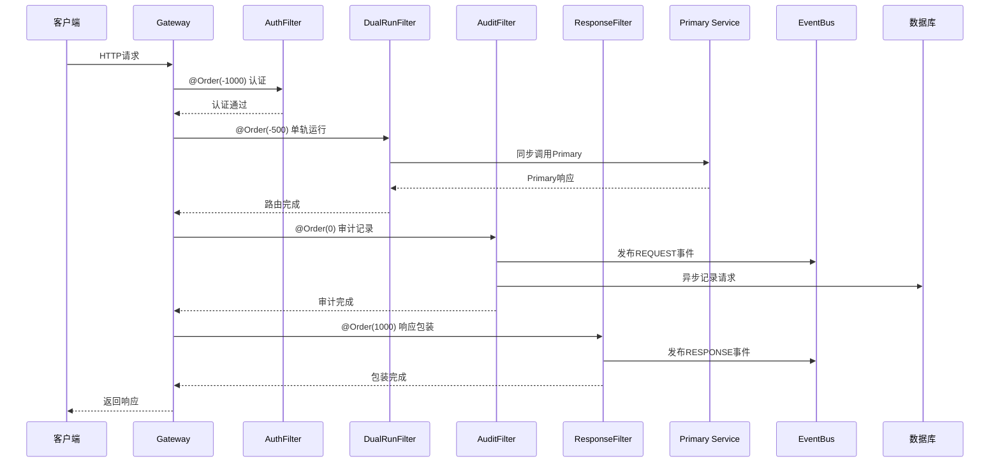

---

## 🔗 模块依赖关系图

### 模块架构图

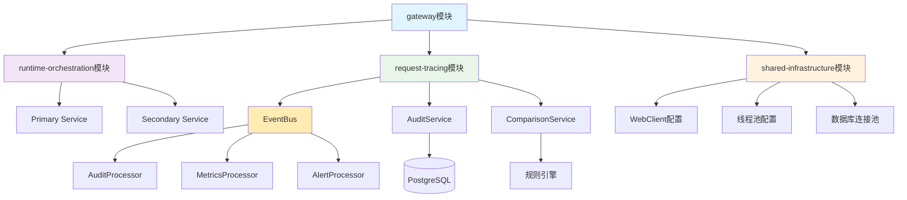

### 模块职责说明

| 模块名称 | 核心职责 | 包含组件 |
|----------|----------|----------|
| **gateway** | 技术网关 | Filter实现、路由配置 |
| **runtime-orchestration** | 业务编排 | 双轨运行逻辑、模式切换 |
| **request-tracing** | 请求追踪 | 审计服务、事件处理 |
| **shared-infrastructure** | 基础设施 | 事件总线、工具类 |

---

## 🔄 不阻塞Primary流程图 - 全异步链路设计

### 核心设计：Primary路径绝对优先

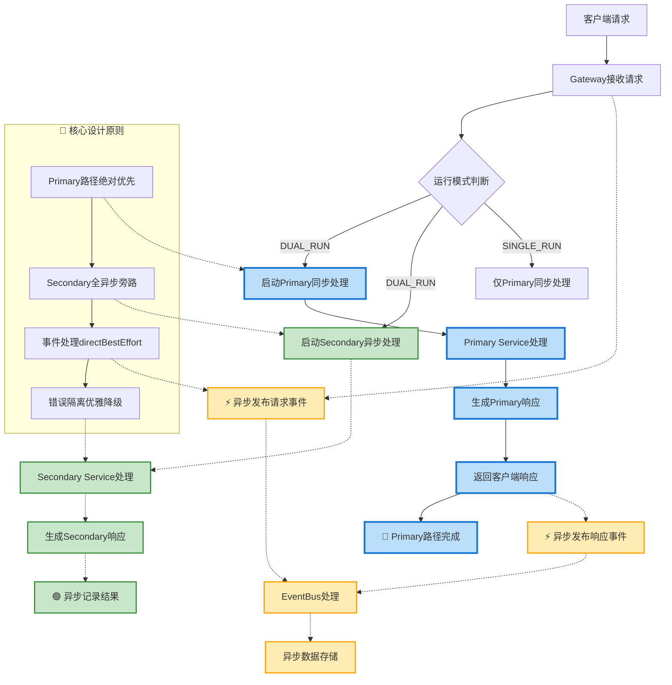

### 事件处理流程

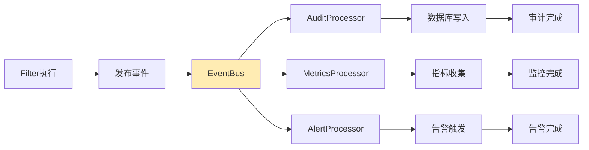

---

## ⚡ 性能优化流程图

### 异步处理优化

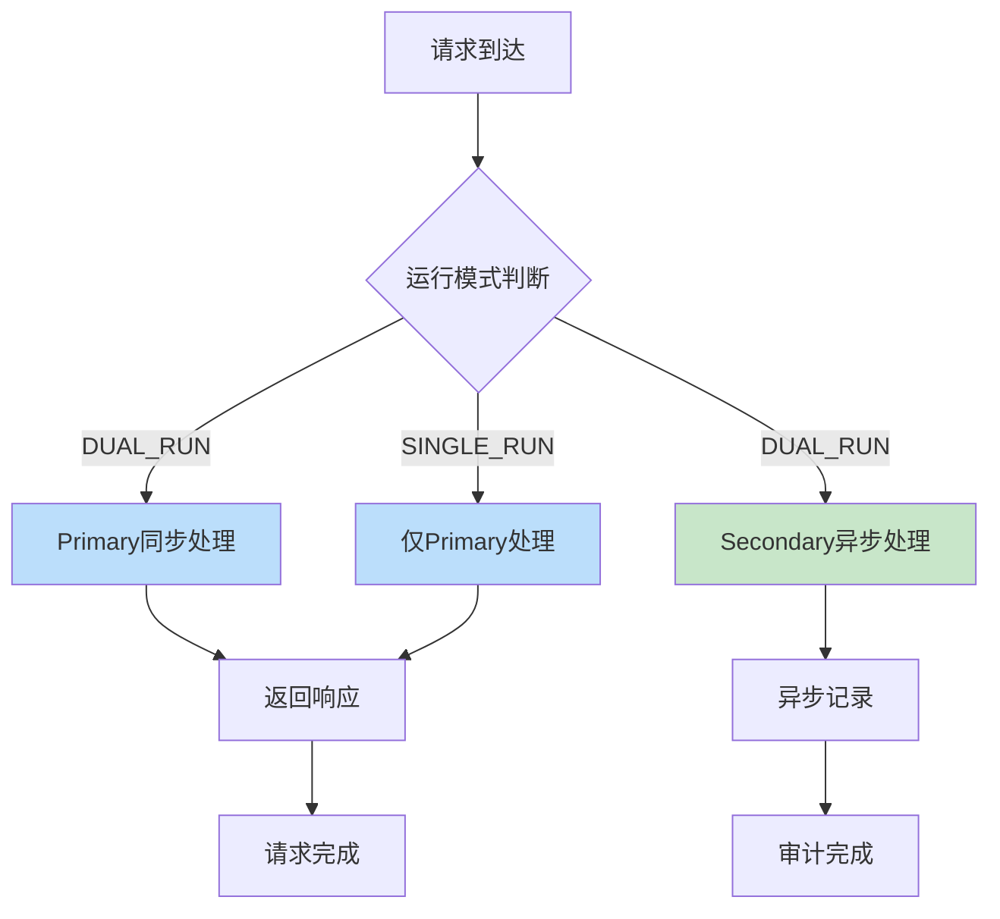

### 错误处理流程

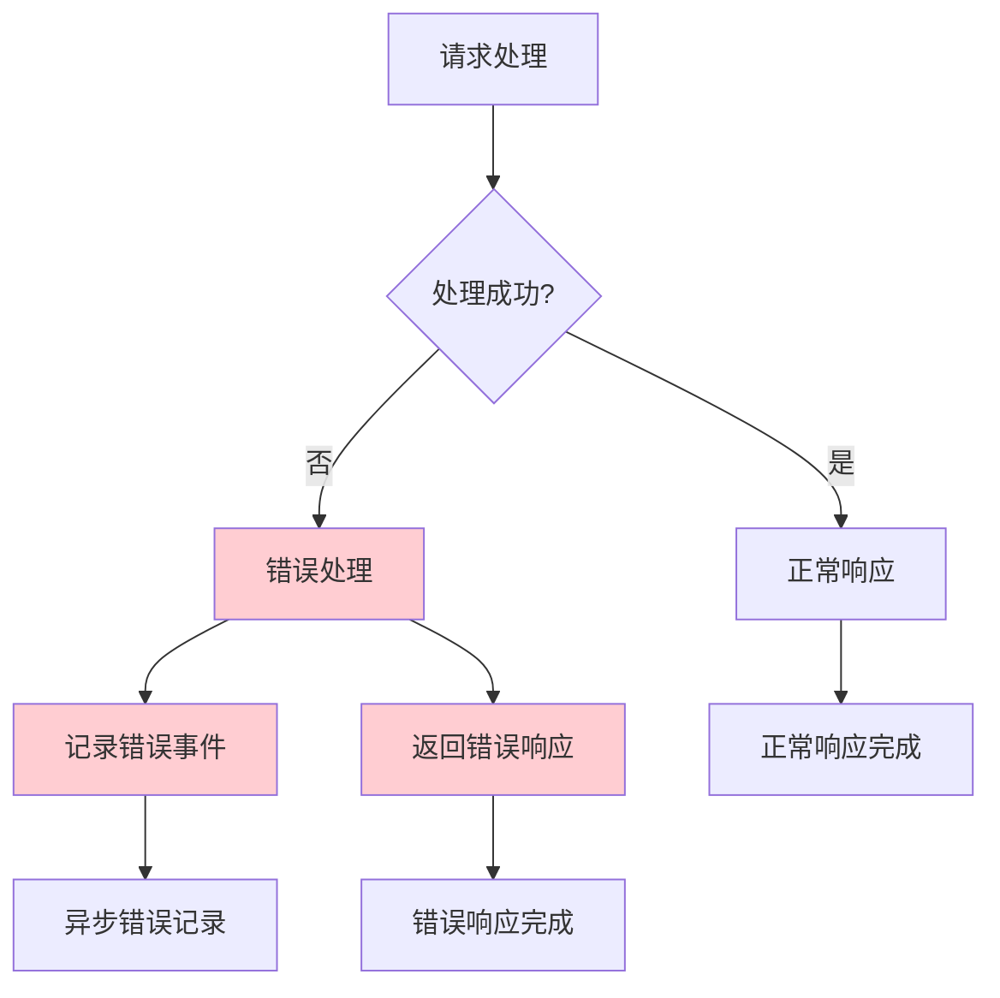

---

## 📈 监控指标图

### 关键性能指标

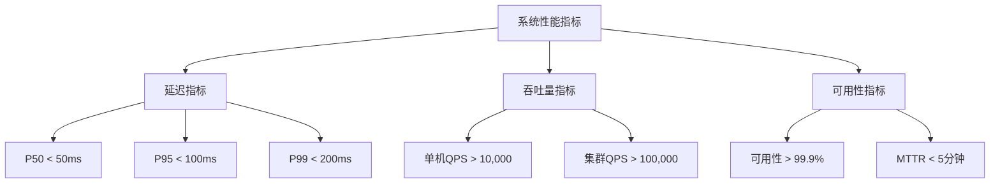

### 系统健康状态

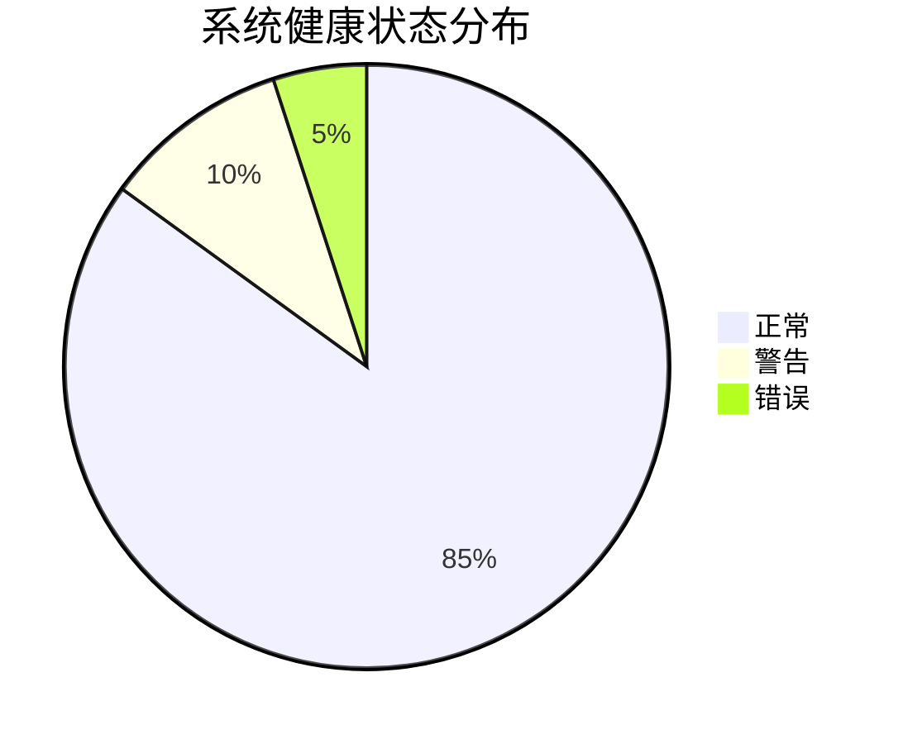

---

## 🎯 架构优势可视化

### 技术选型优势对比

| 技术组件 | 性能 | 生态 | 运维 | 扩展 | 总分 |
|----------|------|------|------|------|------|
| **Spring Cloud Gateway** | ⭐⭐⭐⭐⭐ | ⭐⭐⭐⭐⭐ | ⭐⭐⭐⭐ | ⭐⭐⭐⭐ | **18/20** |
| **Netflix Zuul** | ⭐⭐⭐ | ⭐⭐⭐⭐ | ⭐⭐⭐ | ⭐⭐⭐ | **13/20** |
| **Nginx** | ⭐⭐⭐⭐⭐ | ⭐⭐ | ⭐⭐⭐ | ⭐⭐⭐ | **13/20** |

**优势说明：**
- ✅ **Spring Cloud Gateway**：现代化反应式架构，完整生态支持
- ⚠️ **Netflix Zuul**：传统阻塞式，性能有限
- ⚠️ **Nginx**：高性能但缺乏Java生态集成

### 架构演进路径

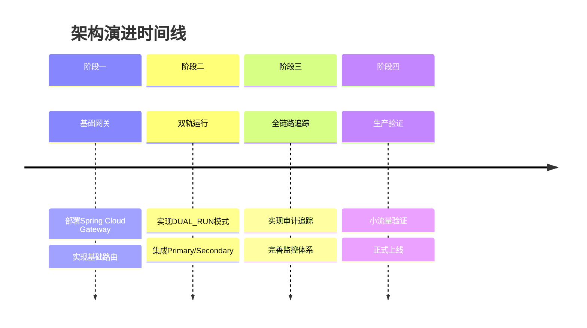

---

## 🔧 实施路线图

### 开发实施流程

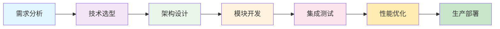

### 风险评估矩阵

| 风险类型 | 影响程度 | 发生概率 | 风险等级 | 应对措施 |
|----------|----------|----------|----------|----------|
| **Secondary故障** | 低 | 低 | 🟢 低风险 | 异步处理，不影响Primary |
| **事件处理延迟** | 中 | 中 | 🟡 中风险 | 背压控制，监控告警 |
| **配置错误** | 高 | 中 | 🔴 高风险 | 配置验证，版本回滚 |
| **网络问题** | 高 | 低 | 🟡 中风险 | 熔断机制，超时控制 |

**风险等级说明：**
- 🟢 **低风险**：影响有限，有完善应对措施
- 🟡 **中风险**：需要监控和预警
- 🔴 **高风险**：需要重点防范和快速响应

---

*本文档通过可视化图表全面展示了系统架构设计，便于团队理解和沟通。*