# 全异步链路系统 - 架构图与时序图

## 📊 整体架构图 - 突出全异步链路设计

### 核心设计理念：全异步链路，不影响Primary

```mermaid
graph TB
    A[客户端] --> B[Spring Cloud Gateway]
    
    subgraph "Gateway核心 - 不阻塞Primary设计"
        B --> C[AuthFilter<br/>认证鉴权]
        C --> D[DualRunFilter<br/>双轨运行编排]
        D --> E[AuditFilter<br/>异步审计]
        E --> F[ResponseFilter<br/>响应包装]
    end
    
    subgraph "🔵 Primary路径（同步关键路径）"
        D -->|同步调用| G[Primary Service]
        G --> H[响应客户端]
        
        style G fill:#bbdefb,stroke:#1976d2,stroke-width:3px
        style H fill:#bbdefb,stroke:#1976d2,stroke-width:3px
    end
    
    subgraph "🟢 Secondary路径（全异步旁路）"
        D -.->|异步调用| I[Secondary Service]
        I -.-> J[异步记录结果]
        
        style I fill:#c8e6c9,stroke:#388e3c,stroke-width:2px
        style J fill:#c8e6c9,stroke:#388e3c,stroke-width:2px
    end
    
    subgraph "⚡ 事件处理系统（全异步）"
        E -->|异步发布| K[EventBus<br/>directBestEffort]
        K -->|异步处理| L[AuditProcessor]
        K -->|异步处理| M[MetricsProcessor]
        K -->|异步处理| N[AlertProcessor]
        
        style K fill:#ffecb3,stroke:#ffa000,stroke-width:2px
    end
    
    subgraph "💾 数据存储（异步写入）"
        L -.-> O[(PostgreSQL)]
        M -.-> P[Prometheus]
        N -.-> Q[AlertManager]
        
        style O fill:#f8bbd9,stroke:#c2185b,stroke-width:2px
    end
    
    F --> H
    
    %% 关键路径标注
    classDef primaryPath fill:#e3f2fd,stroke:#1976d2,stroke-width:3px
    classDef asyncPath fill:#f1f8e9,stroke:#388e3c,stroke-width:2px,dashed
    classDef eventPath fill:#fffde7,stroke:#ffa000,stroke-width:2px
    
    class G,H primaryPath
    class I,J asyncPath
    class K,L,M,N eventPath
    
    %% 设计原则标注
    P1["🎯 设计原则<br/>不阻塞Primary"] --> D
    P2["⚡ 技术实现<br/>directBestEffort"] --> K
    P3["🛡️ 错误隔离<br/>优雅降级"] --> I
    
    style P1 fill:#e8f5e8,stroke:#4caf50
    style P2 fill:#e3f2fd,stroke:#2196f3
    style P3 fill:#ffebee,stroke:#f44336
```

### 架构特点说明

**核心架构模式：**
- **反应式网关**：基于Spring Cloud Gateway + WebFlux
- **双轨运行**：Primary同步 + Secondary异步旁路
- **事件驱动**：松耦合的事件处理架构
- **注解驱动**：基于@Order的Filter执行顺序管理

**技术优势：**
- ✅ **高性能**：单机QPS > 10,000
- ✅ **低延迟**：P99响应时间 < 100ms
- ✅ **弹性设计**：熔断、限流、降级策略
- ✅ **可观测性**：完整监控体系

---

## ⏱️ 请求处理时序图 - 突出全异步设计

### DUAL_RUN模式时序图（不阻塞Primary）

```mermaid
sequenceDiagram
    participant C as 客户端
    participant G as Gateway
    participant A as AuthFilter
    participant R as DualRunFilter
    participant AU as AuditFilter
    participant RS as ResponseFilter
    participant P as Primary Service
    participant S as Secondary Service
    participant E as EventBus
    participant DB as 数据库
    
    C->>G: HTTP请求
    
    Note over G: 🔵 Primary路径开始（关键路径）
    
    G->>A: @Order(-1000) 认证
    A-->>G: 认证通过
    
    G->>R: @Order(-500) 双轨运行编排
    
    Note over R: 🎯 关键设计：Secondary异步，不阻塞Primary
    
    R->>P: 同步调用Primary
    
    Note over R,S: 🟢 Secondary异步启动（不等待）
    R->>S: 异步调用Secondary
    
    Note over R: ⚡ Primary继续，不等待Secondary
    P-->>R: Primary响应
    R-->>G: 路由完成
    
    Note over G: 🔵 Primary路径继续
    
    G->>AU: @Order(0) 异步审计
    
    Note over AU,E: ⚡ 事件异步发布（directBestEffort）
    AU->>E: 异步发布REQUEST事件
    AU-->>G: 审计完成（不等待事件处理）
    
    G->>RS: @Order(1000) 响应包装
    RS->>E: 异步发布RESPONSE事件
    RS-->>G: 包装完成
    
    G-->>C: 🔵 返回响应（Primary完成）
    
    Note over C: ✅ 客户端收到响应，Primary路径结束
    
    Note over S,E,DB: 🟢 Secondary和事件处理继续（全异步）
    
    S-->>DB: 异步记录结果
    S->>E: 异步发布RESPONSE事件
    
    E->>DB: 异步处理事件
    
    Note over S,E,DB: 🎯 设计原则：异步处理失败不影响Primary
```

### SINGLE_RUN模式时序图

```mermaid
sequenceDiagram
    participant C as 客户端
    participant G as Gateway
    participant A as AuthFilter
    participant R as DualRunFilter
    participant AU as AuditFilter
    participant RS as ResponseFilter
    participant P as Primary Service
    participant E as EventBus
    participant DB as 数据库
    
    C->>G: HTTP请求
    
    G->>A: @Order(-1000) 认证
    A-->>G: 认证通过
    
    G->>R: @Order(-500) 单轨运行
    R->>P: 同步调用Primary
    
    P-->>R: Primary响应
    R-->>G: 路由完成
    
    G->>AU: @Order(0) 审计记录
    AU->>E: 发布REQUEST事件
    AU->>DB: 异步记录请求
    AU-->>G: 审计完成
    
    G->>RS: @Order(1000) 响应包装
    RS->>E: 发布RESPONSE事件
    RS-->>G: 包装完成
    
    G-->>C: 返回响应
```

---

## 🔗 模块依赖关系图

### 模块架构图

```mermaid
graph TD
    A[gateway模块] --> B[runtime-orchestration模块]
    A --> C[request-tracing模块]
    A --> D[shared-infrastructure模块]
    
    B --> E[Primary Service]
    B --> F[Secondary Service]
    
    C --> G[EventBus]
    C --> H[AuditService]
    C --> I[ComparisonService]
    
    D --> J[WebClient配置]
    D --> K[线程池配置]
    D --> L[数据库连接池]
    
    G --> M[AuditProcessor]
    G --> N[MetricsProcessor]
    G --> O[AlertProcessor]
    
    H --> P[(PostgreSQL)]
    I --> Q[规则引擎]
    
    style A fill:#e1f5fe
    style B fill:#f3e5f5
    style C fill:#e8f5e8
    style D fill:#fff3e0
    style G fill:#ffecb3
```

### 模块职责说明

| 模块名称 | 核心职责 | 包含组件 |
|----------|----------|----------|
| **gateway** | 技术网关 | Filter实现、路由配置 |
| **runtime-orchestration** | 业务编排 | 双轨运行逻辑、模式切换 |
| **request-tracing** | 请求追踪 | 审计服务、事件处理 |
| **shared-infrastructure** | 基础设施 | 事件总线、工具类 |

---

## 🔄 不阻塞Primary流程图 - 全异步链路设计

### 核心设计：Primary路径绝对优先

```mermaid
flowchart TD
    A[客户端请求] --> B[Gateway接收请求]
    
    B --> C{运行模式判断}
    
    C -->|DUAL_RUN| D[启动Primary同步处理]
    C -->|DUAL_RUN| E[启动Secondary异步处理]
    C -->|SINGLE_RUN| F[仅Primary同步处理]
    
    %% Primary路径（关键路径）
    D --> G[Primary Service处理]
    G --> H[生成Primary响应]
    H --> I[返回客户端响应]
    I --> J[🔵 Primary路径完成]
    
    %% Secondary路径（全异步旁路）
    E -.-> K[Secondary Service处理]
    K -.-> L[生成Secondary响应]
    L -.-> M[🟢 异步记录结果]
    
    %% 事件处理（全异步）
    B -.-> N[⚡ 异步发布请求事件]
    I -.-> O[⚡ 异步发布响应事件]
    N -.-> P[EventBus处理]
    O -.-> P
    P -.-> Q[异步数据存储]
    
    %% 关键路径标注
    style D fill:#bbdefb,stroke:#1976d2,stroke-width:3px
    style G fill:#bbdefb,stroke:#1976d2,stroke-width:3px
    style H fill:#bbdefb,stroke:#1976d2,stroke-width:3px
    style I fill:#bbdefb,stroke:#1976d2,stroke-width:3px
    style J fill:#bbdefb,stroke:#1976d2,stroke-width:3px
    
    %% 异步路径标注
    style E fill:#c8e6c9,stroke:#388e3c,stroke-width:2px
    style K fill:#c8e6c9,stroke:#388e3c,stroke-width:2px
    style L fill:#c8e6c9,stroke:#388e3c,stroke-width:2px
    style M fill:#c8e6c9,stroke:#388e3c,stroke-width:2px
    
    %% 事件路径标注
    style N fill:#ffecb3,stroke:#ffa000,stroke-width:2px
    style O fill:#ffecb3,stroke:#ffa000,stroke-width:2px
    style P fill:#ffecb3,stroke:#ffa000,stroke-width:2px
    style Q fill:#ffecb3,stroke:#ffa000,stroke-width:2px
    
    %% 设计原则标注
    subgraph "🎯 核心设计原则"
        PR1[Primary路径绝对优先] --> PR2[Secondary全异步旁路]
        PR2 --> PR3[事件处理directBestEffort]
        PR3 --> PR4[错误隔离优雅降级]
    end
    
    PR1 -.-> D
    PR2 -.-> E
    PR3 -.-> N
    PR4 -.-> K
```

### 事件处理流程

```mermaid
flowchart LR
    A[Filter执行] --> B[发布事件]
    
    B --> C[EventBus]
    
    C --> D[AuditProcessor]
    C --> E[MetricsProcessor]
    C --> F[AlertProcessor]
    
    D --> G[数据库写入]
    E --> H[指标收集]
    F --> I[告警触发]
    
    G --> J[审计完成]
    H --> K[监控完成]
    I --> L[告警完成]
    
    style C fill:#ffecb3
```

---

## ⚡ 性能优化流程图

### 异步处理优化

```mermaid
flowchart TD
    A[请求到达] --> B{运行模式判断}
    
    B -->|DUAL_RUN| C[Primary同步处理]
    B -->|DUAL_RUN| D[Secondary异步处理]
    B -->|SINGLE_RUN| E[仅Primary处理]
    
    C --> F[返回响应]
    D --> G[异步记录]
    E --> F
    
    F --> H[请求完成]
    G --> I[审计完成]
    
    style C fill:#bbdefb
    style D fill:#c8e6c9
    style E fill:#bbdefb
```

### 错误处理流程

```mermaid
flowchart TD
    A[请求处理] --> B{处理成功?}
    
    B -->|是| C[正常响应]
    B -->|否| D[错误处理]
    
    D --> E[记录错误事件]
    D --> F[返回错误响应]
    
    E --> G[异步错误记录]
    F --> H[错误响应完成]
    
    C --> I[正常响应完成]
    
    style D fill:#ffcdd2
    style E fill:#ffcdd2
    style F fill:#ffcdd2
```

---

## 📈 监控指标图

### 关键性能指标

```mermaid
quadrantChart
    title 系统性能指标矩阵
    x-axis 低延迟 --> 高延迟
    y-axis 低吞吐量 --> 高吞吐量
    
    quadrant-1 优化目标区
    quadrant-2 高延迟区
    quadrant-3 低性能区
    quadrant-4 高吞吐区
    
    Primary路径: [0.2, 0.8]
    Secondary路径: [0.7, 0.6]
    事件处理: [0.3, 0.4]
    数据库写入: [0.6, 0.3]
```

### 系统健康状态

```mermaid
pie title 系统健康状态分布
    "正常" : 85
    "警告" : 10
    "错误" : 5
```

---

## 🎯 架构优势可视化

### 技术选型优势对比

```mermaid
xychart-beta
    title 技术选型优势对比
    x-axis ["性能", "生态", "运维", "扩展"]
    y-axis "评分" 0 --> 5
    
    "Spring Cloud Gateway" : [5, 5, 4, 4]
    "Netflix Zuul" : [3, 4, 3, 3]
    "Nginx" : [5, 2, 3, 3]
```

### 架构演进路径

```mermaid
timeline
    title 架构演进时间线
    
    section 阶段一
        基础网关 : 部署Spring Cloud Gateway
        : 实现基础路由
    
    section 阶段二
        双轨运行 : 实现DUAL_RUN模式
        : 集成Primary/Secondary
    
    section 阶段三
        全链路追踪 : 实现审计追踪
        : 完善监控体系
    
    section 阶段四
        生产验证 : 小流量验证
        : 正式上线
```

---

## 🔧 实施路线图

### 开发实施流程

```mermaid
graph LR
    A[需求分析] --> B[技术选型]
    B --> C[架构设计]
    C --> D[模块开发]
    D --> E[集成测试]
    E --> F[性能优化]
    F --> G[生产部署]
    
    style A fill:#e1f5fe
    style B fill:#f3e5f5
    style C fill:#e8f5e8
    style D fill:#fff3e0
    style E fill:#fce4ec
    style F fill:#ffecb3
    style G fill:#c8e6c9
```

### 风险评估矩阵

```mermaid
quadrantChart
    title 实施风险评估
    x-axis 低影响 --> 高影响
    y-axis 低概率 --> 高概率
    
    quadrant-1 监控区
    quadrant-2 重点防范区
    quadrant-3 忽略区
    quadrant-4 关注区
    
    "性能瓶颈": [0.7, 0.6]
    "数据一致性": [0.8, 0.3]
    "安全漏洞": [0.9, 0.2]
    "配置错误": [0.4, 0.7]
```

---

*本文档通过可视化图表全面展示了系统架构设计，便于团队理解和沟通。*